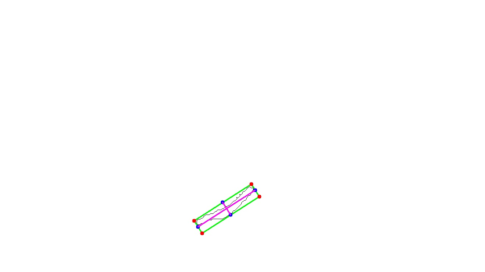

# Measuring-crack-size-in-an-image-with-OpenCV
## (Estimate the physical size from CV approach)

Using the segmented crack image, we can accurately calculate various metrics of the crack using computer vision techniques.
These metrics, in the form of pixel coordinates, can then be used to determine the thickness of the crack.
Additionally, when combined with the depth frame obtained during the inspection, a more comprehensive analysis can be conducted.
 


Just run the following command

```
python3 min_rect.py -i crack_seg.jpg
python3 sliding_window.py -i crack_seg.jpg -o horizontal
python3 sliding_window.py -i crack_seg.jpg -o vertical

```


